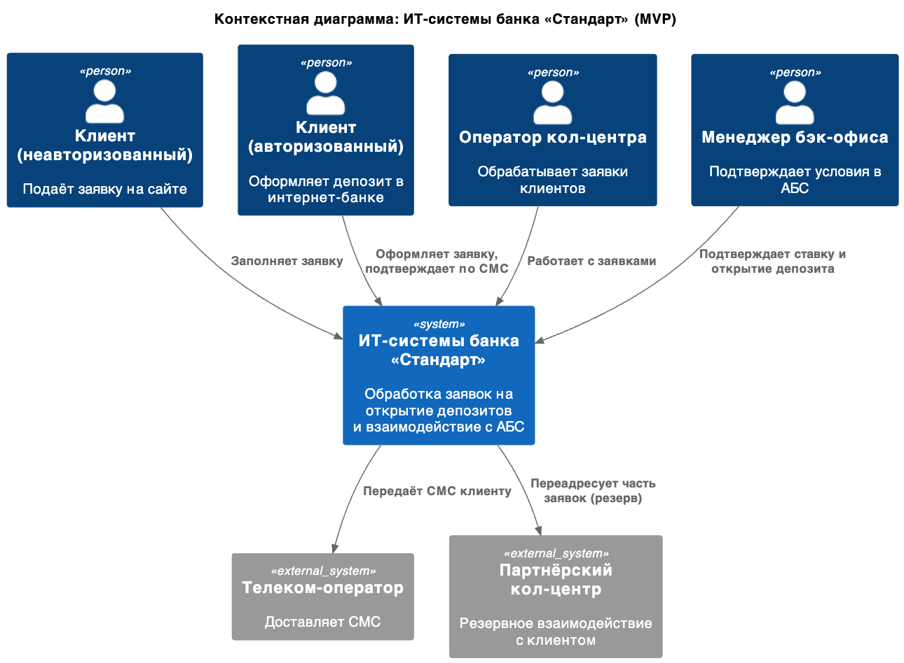
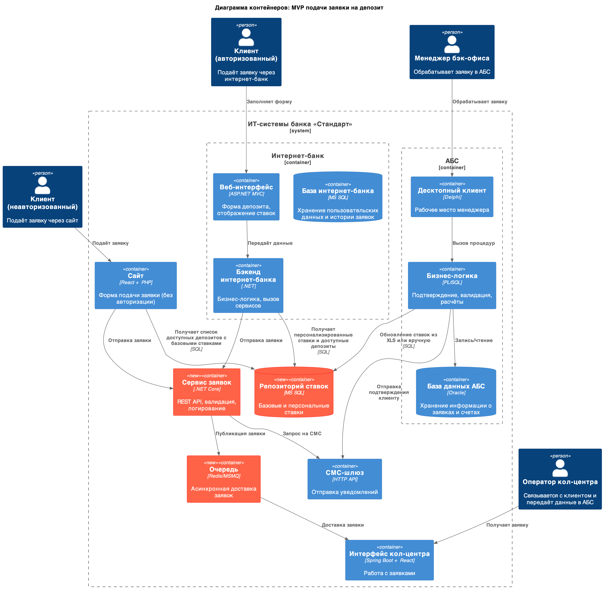

### **Название задачи: Разработка архитектуры MVP для подачи заявки на открытие депозита через сайт и интернет-банк** 
### **Автор: Максим С.**
### **Дата: 2025-05-11**
### **Функциональные требования**

|**№**|**Действующие лица или системы**|**Use Case**|**Описание**|
| :-: | :- | :- | :- |
| 1 | Клиент (неавторизованный) | Подача заявки на депозит через сайт | Клиент заполняет ФИО и телефон, заявка поступает в систему кол-центра, менеджер связывается с клиентом |
| 2 | Клиент (авторизованный) | Подача заявки на депозит через интернет-банк | Клиент выбирает счёт, сумму, персональную ставку и подтверждает операцию через СМС |
| 3 | Кол-центр | Обработка заявки с сайта | Менеджер связывается с клиентом, фиксирует результат, передаёт информацию в АБС для дальнейшей обработки |
| 4 | Менеджер бэк-офиса | Обработка заявки в АБС | Менеджер подтверждает условия, инициирует открытие депозита и отправку СМС клиенту |
| 5 | Система интернет-банка | Отображение ставок | Отображает персонализированные ставки и доступные депозиты для клиента |
| 6 | Сайт | Отображение депозитов | Отображает общий список доступных депозитов с базовыми ставками |
| 7 | СМС-шлюз | Отправка уведомлений | Отправляет клиенту подтверждение условий депозита и успешного открытия |

### **Нефункциональные требования**
Опишите здесь нефункциональные требования и архитектурно-значимые требования.

|**№**|**Требование**|
| :-: | :- |
| 1 | Использование текущих технологий: .NET, SQL Server, Oracle, React |
| 2 | Доступность интернет-банка: 99.9% с резервным ЦОД |
| 3 | Безопасность передачи данных (HTTPS, шифрование) |
| 4 | Быстродействие интерфейса: отклик < 1 сек |
| 5 | Масштабируемость интернет-банка по горизонтали |
| 6 | Изоляция интернет-банка от прямого API АБС |
| 7 | Поддержка ручной обработки заявок в случае сбоев |
| 8 | Минимальные доработки ядра СМС-сервиса (обход доработок подрядчика) |
| 9 | Документирование решений и API |
| 10 | Реализация MVP с возможностью масштабирования до полной автоматизации |

### **Решение**

**Диаграмма контекста (C4 — Context Level)**

**Диаграмма контейнеров (C4 — Container Level)**

**Выбор решений**:

- Разработка нового **микросервиса заявок** — позволяет избежать доработок ядра интернет-банка и СМС-модуля

- Хранение ставок: внедрение **репозитория ставок** (на MS SQL), доступного сайту, интернет-банку, и АБС

- Все внешние вызовы защищены HTTPS

- Kafka не используется на этапе MVP из-за несовместимости с текущим интернет-банком

### **Альтернативы**
**Интеграция интернет-банка напрямую с АБС**:
- Минусы: Перегрузка АБС, высокие риски надёжности, нарушение принципа изоляции систем

**Хранение ставок в XLS как сейчас**:
- Минусы: Высокие риски ошибок, отсутствие централизованного доступа, сложно поддерживать в будущем

**Использование Kafka уже в MVP**:
- Минусы: Несовместимость с текущим стеком интернет-банка, отсутствие готовой экспертизы

**Недостатки, ограничения, риски**

- Текущий интернет-банк — монолит, сложно масштабировать
- Сервис ставок потребует выделенного сопровождения
- Риски в обеспечении целевой доступности без масштабирования инфраструктуры
- Низкая готовность к микросервисной архитектуре на уровне интернет-банка
- Потенциальные сложности с безопасностью при интеграции с кол-центром
- Зависимость от подрядчиков при работе с СМС и интернет-банком