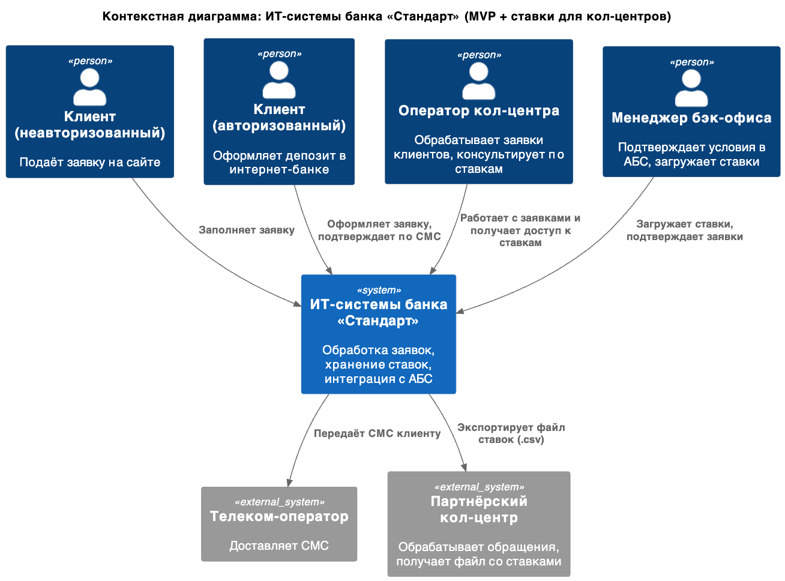
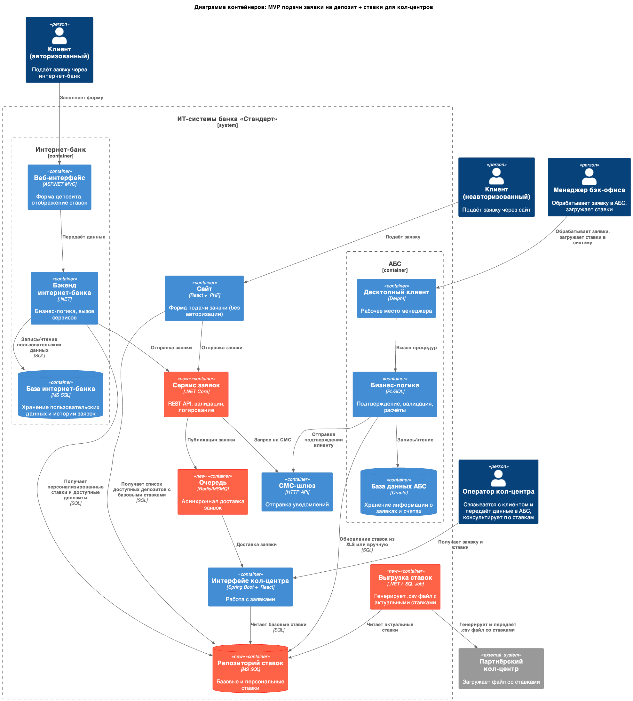

### **Название задачи: Обеспечение доступа к ставкам по депозитам для операторов кол-центра и партнёрского кол-центра в рамках MVP** 
### **Автор: Максим С.**
### **Дата: 2025-05-11**
### **Функциональные требования**

|**№**|**Действующие лица или системы**|**Use Case**|**Описание**|
| :-: | :- | :- | :- |
| 1 | Оператор кол-центра | Получение доступа к ставкам | Оператор получает доступ к актуальным базовым ставкам для консультации клиента по телефону |
| 2 | Партнёрский кол-центр | Получение актуальных ставок | Внешняя система получает ежедневно файл с актуальными базовыми ставками для использования в работе |
| 3 | Сервис ставок | Формирование выгрузки ставок | Формирует файл со ставками и передаёт его для загрузки во внешнюю систему |
| 4 | Менеджер бэк-офиса | Загрузка ставок в систему | Обновляет ставки вручную через АБС на основе Excel-файла или интерфейса |

### **Нефункциональные требования**
|**№**|**Требование**|
| :-: | :- |
| 1 | Ставки обновляются один раз в день вручную в АБС |
| 2 | Кол-центр получает доступ к ставкам без изменения архитектуры его системы |
| 3 | Партнёрский кол-центр получает ставки только в виде файла (например, XLS или CSV) |
| 4 | Выгрузка должна быть защищена от несанкционированного доступа (например, передача через защищённую папку в локальной сети) |
| 5 | Выгрузка должна быть автоматизирована (по расписанию или после обновления ставок) |
| 6 | Решение должно использовать уже существующие технологии: Oracle, MS SQL, .NET, React |

### **Решение**
**Диаграмма контекста (C4 — Context Level)**

**Диаграмма контейнеров (C4 — Container Level)**

### **Альтернативы**
|**Вариант**|**ДОписание**|**Недостатки**|
| :-: | :- | :- |
| 1 | Подключить партнёрский кол-центр по SFTP с автообновлением файла | Партнёр не поддерживает SFTP, требует затрат |
| 2 | Разработка веб-интерфейса для ставок для внешнего партнёра | Сложно реализовать с учётом ограничений безопасности |
| 3 | Интеграция через API | Невозможна из-за ограничений партнёра |

**Недостатки, ограничения, риски**

- Партнёрский кол-центр получает ставки в виде файла без информации о времени обновления или версии, что усложняет диагностику проблем с актуальностью.

- Передача ставок в партнёрский кол-центр возможна только через файловую выгрузку — невозможны API, SFTP или push-уведомления. Это ограничивает автоматизацию и мониторинг.

- В интернет-банке, на сайте и в кол-центре происходят отдельные обращения к StakesRepo. В случае несовпадения фильтрации или ошибок кэширования — возможны расхождения

